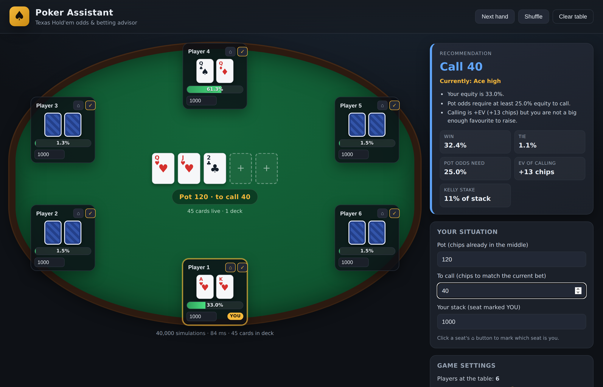
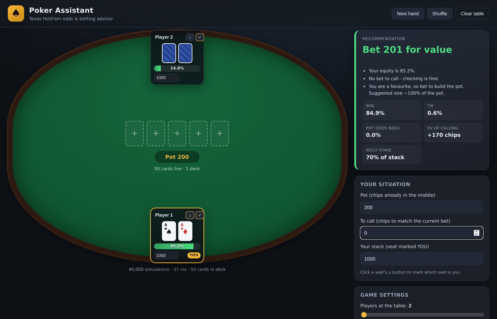
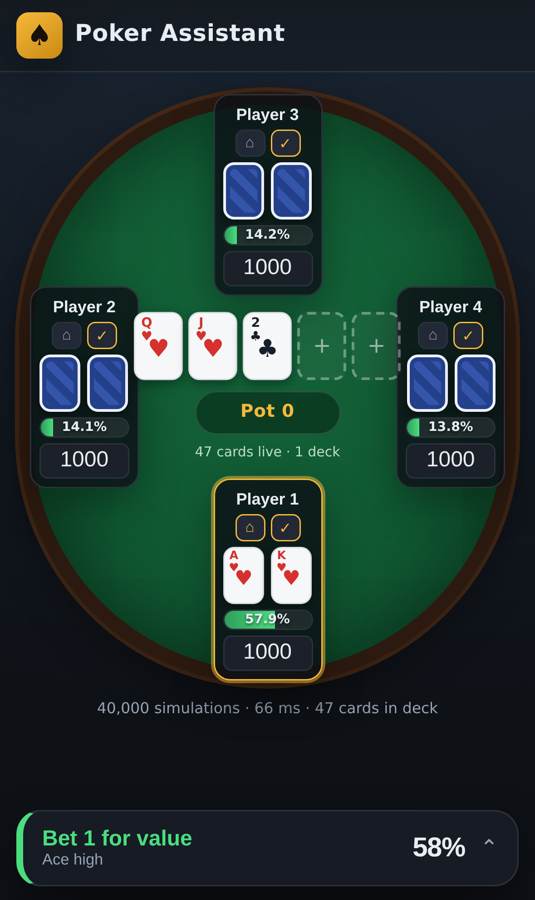
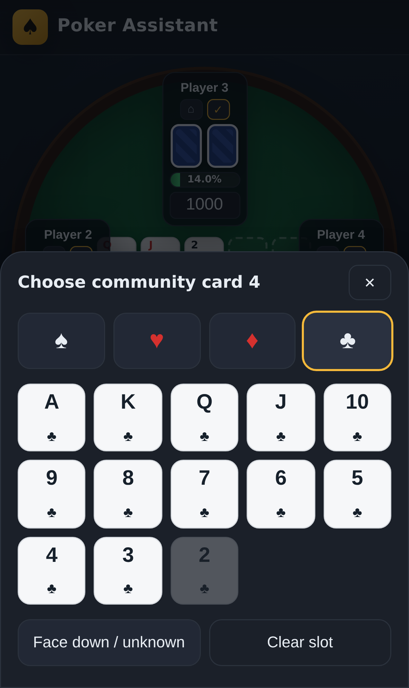
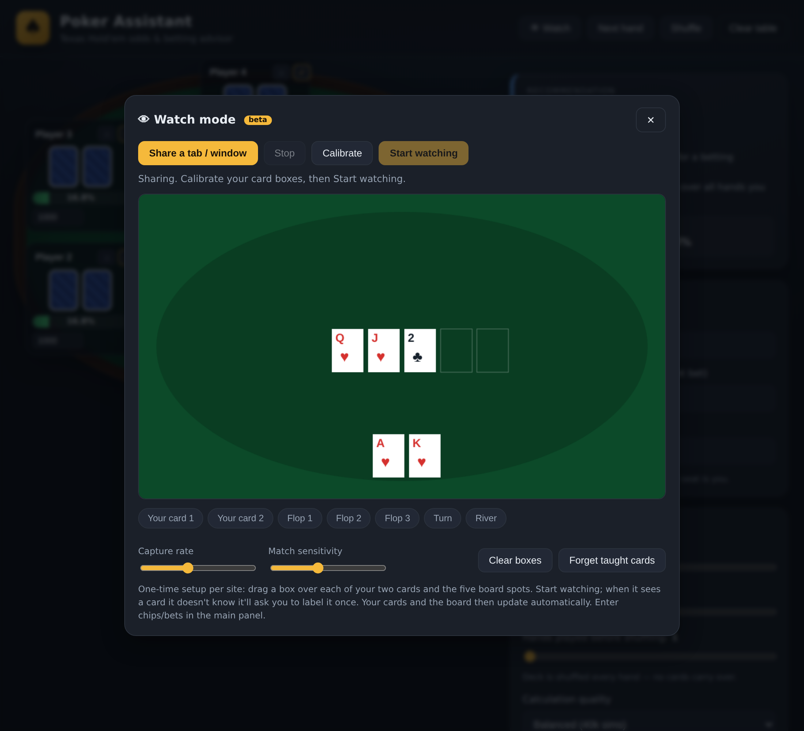

# ♠ Poker Assistant — Texas Hold'em Odds & Betting Advisor

A fast, zero-install web app that shows your **real chance of winning** a Texas
Hold'em hand and tells you whether to **bet, call, raise, check or fold** — and
how much. Enter the cards you can see, and the odds update **exactly** with
what's still live in the deck.

Everything runs in the browser (no server, no tracking, no build step), so you
can host it for free on **GitHub Pages** and use it live at the table.



---

## ✨ Features

- **Poker-table interface.** Every seat is drawn like a real seat with face-up
  or face-down cards, the community cards in the middle, the pot, and a **live
  win-probability bar for every player**.
- **Exact, self-updating odds.** Unknown cards are always drawn from the
  *actual remaining deck* — your hole cards, the board and mucked cards are
  removed first — so probabilities change precisely as cards appear.
  - When only the board runout is unknown, the result is the **true
    probability** from full enumeration of every possible runout.
  - Otherwise a fast **Monte-Carlo simulation** (10k–300k deals) is used.
- **Watch mode (beta).** Read a shared browser tab or window **live** and fill
  your cards and the board automatically, so you barely type anything. Uses the
  Screen Capture API — it can watch a *different* site than this app. Desktop
  only, and intended for play-money / practice / replay use.
- **Best / worst outlook.** For your hand it shows the strongest and weakest
  five-card hand you can still finish with by the river — your ceiling and
  floor — found by enumerating every remaining board runout from the unseen
  deck (e.g. *Best: Royal Flush · Worst: Ace high*).
- **Betting recommendation.** Combines your equity with the pot, the price to
  call and your stack to recommend an action and a **bet size**, using **pot
  odds**, **expected value (EV)** and the **Kelly criterion** (the bet fraction
  that maximises long-run winnings). All the numbers are shown so you can check
  the maths.
- **Fully customisable game.** Number of players (2–10) and number of decks
  (1–8). By default the deck is **reshuffled every hand** (a full, fresh deck
  each deal); turn that option off to track a multi-hand **shoe**, choosing how
  many hands are dealt before the shuffle — dealt cards then stay removed from
  the odds across the shoe.
- **Built for speed.** The simulation runs in a Web Worker so the interface
  never freezes; a full recalculation typically takes **under 100 ms**.
- **First-class iPhone experience.** A dedicated mobile layout built to Apple
  HIG standards: safe-area (notch / home-indicator) aware, no zoom-on-focus,
  a thumb-reachable recommendation bar, an iOS-style bottom sheet for advice
  and settings, and a two-step card picker with large tap targets. Add it to
  your Home Screen and it launches full-screen like a native app.
- **Works offline & on mobile.** Responsive layout, plain HTML/CSS/JS.

---

## 🚀 Use it

### Option A — GitHub Pages (recommended)
1. Push this repository to GitHub.
2. Go to **Settings → Pages**.
3. Under **Build and deployment**, set **Source = Deploy from a branch**,
   pick your branch and the **`/ (root)`** folder, and save.
4. Open the published URL (e.g. `https://<you>.github.io/Poker-Assistant/`).

### Option B — Run locally
No dependencies are required. Any static file server works:

```bash
npm start          # serves on http://localhost:8080
# or:  python3 -m http.server 8080
```

Then open <http://localhost:8080>.

> Tip: opening `index.html` straight from the file system also works — the app
> automatically falls back to computing on the main thread if the Web Worker
> can't load over `file://`.

---

## 🕹️ How to use it

1. **Mark your seat.** Click the `⌂` button on the seat that is you (it gets a
   gold **YOU** tag).
2. **Enter cards.** Click any card slot to open the picker and choose a rank and
   suit. Your own cards and the community cards are face-up; opponents you can't
   see stay face-down (their hands are simulated).
3. **Enter the money.** Fill in the **pot**, the **amount to call**, and your
   **stack**.
4. **Read the advice.** The panel shows the recommended action, a suggested
   size, each player's win %, and the supporting maths.
5. **Between hands.** Use **Next hand** to muck the current cards (they stay
   dead in the shoe until a shuffle) or **Shuffle** to return everything to the
   deck.



### On iPhone

The whole tool is rebuilt for small screens: the felt fits the seats, the
always-visible bar at the bottom shows the current call (in the thumb zone),
and tapping it opens a native-style sheet with the full advice and settings.
The card picker becomes a two-step suit → rank selector with large targets.

<p>
  
  &nbsp;&nbsp;
  
</p>

**Install to Home Screen (iOS):** open the site in Safari → Share → *Add to
Home Screen*. It then launches full-screen with its own icon (a web app
manifest and Apple touch icon are included).

---

## 👁 Watch mode — read the table automatically (beta)

Instead of typing cards, let the app **read them off another window**. It uses
the browser's Screen Capture API (`getDisplayMedia`), so it can watch a
different site/tab than the app itself and update the odds live.



**How to use it** (desktop Chrome / Edge / Firefox):
1. Click **👁 Watch**, then **Share a tab / window** and pick your poker window.
2. **Calibrate once:** click a box below the preview (e.g. *Your card 1*), then
   **trace it one straight edge at a time** — click each corner, and click the
   first point again (it turns green) to close. This lets you draw a tight,
   angled outline that follows a card even when it's partly behind another and
   leaves out the felt and any neighbouring card. A **magnifier loupe** follows
   your cursor for precise corners; Backspace undoes a point and Esc cancels. Do
   this for your two cards, the five board spots, and optionally the **Pot** and
   **My-stack** numbers. Boxes are saved, and the best-fit card is shown the
   moment you finish a trace.
3. Click **Start watching.** The **whole 52-card deck is recognised out of the
   box** from a built-in database of the site's card art — it matches on the
   number, suit and colour and ignores the green table, so it doesn't need to
   see the whole card. You normally teach *nothing*. If it ever meets a mark it
   doesn't know it shows the exact crop (magnified) and asks you to label it
   **once**. If the recogniser has mislabelled what it found (say it
   asks for a *suit* but you're looking at a *rank*), use the **Rank / Suit**
   switch; if the crop is cut off or grabbing the wrong thing, hit
   **↻ Re-box** to redraw that one box.
4. **Fix any card in one click.** The live strip shows every card it read —
   click one to open a full 52-card picker, set the true card, and it both
   corrects the table **and learns** that card for next time. This works for
   your hole cards *and* the board.
5. **Close the panel with ✕** — it shrinks to a small **live dock** (bottom-left) and keeps watching, so you can
   see the main table update live:
   your cards, the board, the pot, and your stack all fill in, and a big
   **action banner** under your cards shows FOLD / CHECK / CALL / BET. (Click a
   card in the dock to expand and correct it.)
6. Mark the **dealer** with the **D** button on a seat and the advice shows your
   table position (button / blinds / cutoff …).

**Your call & opponents' bets.** Box the **amount on your call button** (over
just the number, e.g. the `100K` in "CALL 100K") — that becomes the price to
call and the recommendation updates; a plain **CHECK** button (no number there)
reads as 0. You can also box **each opponent's bet** in front of their seat — the
**highest** is the current bet, and it sets the price to call if you haven't
boxed the button. The action banner then tells you **FOLD / CHECK / CALL / RAISE**
and a size. (Digits are shared with the Pot/Stack, so you only teach a number
once.)

**Two boxes per card (most reliable).** Each card has an optional second box —
its **· suit** box. Box the number in the card box and the suit in the suit box,
and it reads each directly with no guessing about where the suit is. This is the
steadiest mode, especially for a card that's partly hidden behind another. One
box still works (it auto-splits the number and suit); the suit box is there when
you want the extra certainty.

**Players in & out (two seat boxes, colour rules).** Set **Opponent seats** to
how many opponents are at your table (1–6; you're the last player). For each,
box the **empty-spot** box (where the blue **＋** shows) and the **cards** box
(where their two cards sit). Then: a **blue cross** = **empty**; the cards box
showing **table felt (green)** = **folded** (cards mucked); **no felt** = **in
the hand**. Two sliders tune the blue-cross and felt sensitivity. Click a seat in
the strip to force a state (it sticks until that seat changes). Only in-hand
opponents (+ you) count toward the odds, and the seat count sets the table size
immediately.

**Matching against the card database.** A bundled database (`js/carddb.js`)
holds the number and suit shapes of all 52 cards taken from the site's own card
art. On every box the app trims to just the **red and black marks** (ignoring
the green felt and any snipped edges), splits the number from the suit, and
picks the closest-fitting card in the database by shape **and** colour — so it
recognises a card from its index alone without seeing the whole thing. A card it
still can't place (or gets wrong) is one tap on the live strip to set and teach.

Numbers are read with a decimal point, so **1.2M** is read as 1,200,000 (not
12,000,000), and **K** / **M** suffixes and thousands separators are handled.

**Honest limits.** Recognition is template matching against the card database,
not a trained model: it's accurate on a clean, well-traced box but can misread —
glance at the live strip and one-click any card to fix and teach it. It reads
**your cards, the board, the pot and your stack** (the numbers that drive the
maths). Reading every opponent's stack and auto-detecting the dealer button by
vision aren't done yet (set the D manually). It needs a desktop browser (iOS
Safari can't screen-share) and it never acts for you — it only fills in what
you'd otherwise type. Use it for play-money, practice, or hand-replay study, and
follow the rules of any site you're on.

---

## 🧮 The maths (and why it's trustworthy)

Let `p` be your equity — your probability of winning the pot, with ties counted
as their fractional share (exactly what the simulator returns).

| Concept | Formula | Meaning |
| --- | --- | --- |
| **Pot odds (break-even equity)** | `toCall / (pot + toCall)` | the minimum `p` at which a call is not losing |
| **EV of calling** | `p · pot − (1 − p) · toCall` | expected chips gained/lost by calling |
| **Kelly stake** | `p − (1 − p)·toCall/pot` | fraction of your stack to commit for maximum long-run growth |

The recommendation logic:

- **Fold** when `p` is below the pot odds (a call is −EV).
- **Call / Check** when calling is +EV but you are not a clear favourite.
- **Raise / Bet** when you are a clear favourite, sizing toward the Kelly
  fraction and capping at your stack.

### Verified against known probabilities

The engine ships with a dependency-free test suite that checks the evaluator
and compares computed equities to the **published all-in match-up
probabilities** (see the
[reference table](https://www.pokerstrategy.com/strategy/various-poker/texas-holdem-probabilities/)):

```bash
npm test
```

```
PASS AA vs KK (AA equity ≈ 0.823)   got=0.8269
PASS AKs vs QQ (QQ equity ≈ 0.535)  got=0.5376
PASS AA vs one random hand (≈ 0.852) got=0.8511
...
18 passed, 0 failed
```

The 7-card hand evaluator ranks hands with a provably-correct total ordering
(category + ordered tie-breakers packed into one integer), and even handles the
five-of-a-kind case that only multi-deck play can produce.

---

## 🗂️ Project structure

```
index.html            Page shell and layout
manifest.webmanifest  PWA manifest (Home-Screen install)
css/styles.css        Poker-felt theme, desktop + iPhone layouts
js/cards.js           Card encoding + remaining-deck construction
js/evaluator.js     7-card hand evaluator (exact hand ranking)
js/equity.js        Win/tie/equity engine (exact enumeration + Monte-Carlo)
js/advice.js        Pot odds, EV and Kelly betting recommendation
js/worker.js        Runs the simulation off the main thread
js/app.js           UI, state and the poker-table view
js/watch.js         Watch mode: live screen-capture card recognition
test/engine.test.js Dependency-free correctness suite (npm test)
```

The engine files attach to a shared `Poker` namespace and run **unchanged** in
the browser, the Web Worker, and Node (for the tests) — one source of truth for
the maths.

---

## ⚠️ Notes

- This is a decision-support and learning tool. It assumes the equities you
  enter are the full picture; it does not model opponents' betting tendencies,
  bluffing, or future-street implied odds beyond the transparent formulas above.
- Please follow the rules of any venue you play in regarding electronic aids.

## License

MIT — see below. Use it, fork it, improve it.
